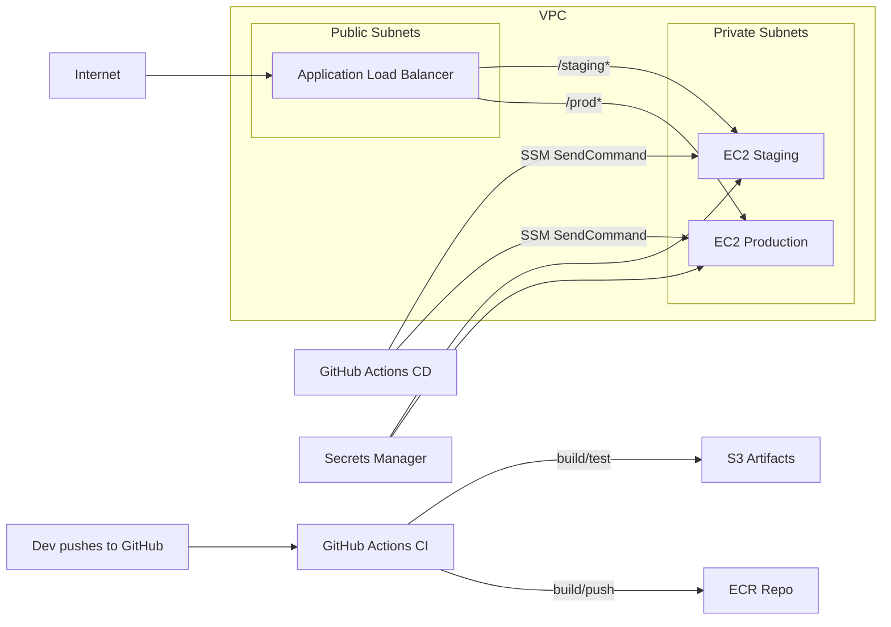

# SaaS Infrastructure Automation & Deployment (AWS + Terraform + GitHub Actions)

This repository demonstrates a secure, automated, and repeatable infrastructure + deployment pipeline for a small SaaS app on **AWS** using **Terraform** and **GitHub Actions**.
It provisions a VPC with public/private subnets, an **ALB**, two **EC2** instances (staging/production), least‑privilege **security groups**, **S3** buckets for artifacts/static assets, and uses **AWS Secrets Manager** + **SSM** for secure runtime secret retrieval. Deployments build/push Docker images to **ECR** and redeploy via **SSM Run Command**. Rollbacks are one click in Actions.

---

## Architecture



**Routing:** `http://<ALB-DNS>/staging` goes to staging; `/prod` (and `/`) goes to production.  
**Parity:** staging & prod AMIs, instance types, and bootstrap are identical (only secrets and ECR tag differ).

---

## What’s inside

- **/infrastructure** — Terraform (modular, parameterized)
  - `modules/vpc` — VPC, IGW, NAT, route tables, public/private subnets
  - `modules/security_groups` — ALB & instance SGs (least privilege)
  - `modules/alb` — ALB, target groups, path‑based listener rules
  - `modules/ec2` — EC2s (staging/prod) + **IAM**, **SSM agent**, **Docker** bootstrap, target group attachments
  - Creates **ECR** repo and **S3** buckets (artifacts + static assets)
- **/.github/workflows**
  - `ci.yml` — unit tests on push/PR, uploads artifacts
  - `deploy.yml` — **auto‑deploy to staging** on merge to `develop`, **deploy to prod** on **Release** from `main`, pushes images to **ECR**, then redeploys via **SSM**
  - `rollback.yml` — manual rollback to a specific SHA or to the last known good
- **/app** — minimal Node.js/Express app (dockerized), with `/health` endpoint
- **/docs** — Mermaid diagram lives in this README; add a Lucidchart/Miro/Draw.io export if desired

---

## Prereqs

- Terraform >= 1.6
- AWS account with permissions to create VPC/EC2/ALB/IAM/ECR/S3/SSM/Secrets
- **GitHub OIDC** to assume roles in your AWS account (no long‑lived keys)
- Two **Secrets Manager** secrets with JSON values (one per env), e.g.
  ```json
  { "APP_ENV": "staging", "APP_SECRET": "rotate_me", "DB_URL": "..." }
  ```

---

## Deploy the infrastructure

1. **Clone** and set AWS credentials locally.
2. **Create or identify** two Secrets Manager secrets; note their **ARNs**.
3. In `infrastructure/envs/staging.example.tfvars`, set:
   ```hcl
   region            = "us-east-1"
   project_name      = "saas-example"
   staging_secret_arn = "arn:aws:secretsmanager:...:saas-example-staging-..."
   prod_secret_arn    = "arn:aws:secretsmanager:...:saas-example-prod-..."
   allow_ssh_cidrs    = [] # keep empty; use SSM
   ```
4. Init/plan/apply:
   ```bash
   cd infrastructure
   terraform init
   terraform plan -var-file=envs/staging.example.tfvars
   terraform apply -var-file=envs/staging.example.tfvars
   ```
5. Output will include:
   - `alb_dns_name` — open `http://<alb_dns_name>/staging` or `/prod`
   - `ecr_repository_url`, `artifact_bucket`, `static_assets_bucket`

> **State backend (optional):** switch to S3 + DynamoDB for remote state & locking.

---

## Configure GitHub Actions (OIDC)

1. Create two IAM roles in AWS that trust **token.actions.githubusercontent.com** and your repo:
   - **Staging role** (least privileges for ECR, S3 artifact bucket paths, SSM SendCommand by tag `Environment=staging`)
   - **Prod role** (same pattern, prod scope/tag)
   > Using scoped conditions on `sub` like `repo:ORG/REPO:environment:staging` is recommended.
2. In your repo **Settings → Secrets and variables → Actions**:
   - **Secrets**
     - `AWS_ROLE_ARN_STAGING` — role ARN for staging
     - `AWS_ROLE_ARN_PROD` — role ARN for prod
   - **Variables**
     - `AWS_ACCOUNT_ID` — your AWS account ID
     - `ECR_REPO` — (defaults to `saas-example-app` if omitted)
     - `ARTIFACT_BUCKET` — the Terraform‑created artifact bucket name
     - `STAGING_SECRET_ARN` / `PROD_SECRET_ARN` — your Secrets ARNs

> The workflows use **OIDC** (no access keys).

---

## Pipeline behavior

- **Push/PR** → `ci.yml`: installs deps, runs `npm test`, uploads app artifact.
- **Merge to `develop`** → `deploy.yml` **deploy-staging**:
  - Builds/pushes `ECR:staging-<SHA>` and updates moving tag `ECR:staging`
  - Updates S3 markers: `deployments/staging/latest.txt` and `previous.txt`
  - Uses **SSM** to run `/usr/local/bin/deploy_app.sh` on instances with tag `Environment=staging`
- **Release published from `main`** → `deploy.yml` **deploy-prod**:
  - Builds/pushes `ECR:prod-<SHA>` and updates moving tag `ECR:prod`
  - Updates S3 markers under `deployments/prod/`
  - SSM deploy to `Environment=production` instances
- **Rollback** → `rollback.yml` (manual):
  - choose `environment` and optional `to_sha`.
  - If `to_sha` omitted, redeploys `previous.txt` marker.
  - Redeploy is idempotent and uses the same SSM script.

---

## Rollback procedure (detail)

1. Open **Actions → Rollback**.
2. Select environment (staging/production).
3. Optionally supply a specific commit SHA (must exist as an image tag `ENV-<SHA>`).
4. Run — the job re‑runs the `deploy_app.sh` script against the chosen image.

> Markers are stored in S3 at `s3://$ARTIFACT_BUCKET/deployments/<env>/(latest|previous).txt`.

---

## Security considerations

- **No plain‑text secrets in code or configs.** Instances fetch JSON from **Secrets Manager** at deploy time.
- **OIDC for CI/CD** — ephemeral credentials, least privilege per environment.
- **Least‑privilege SGs** — only ALB can reach instance app port; egress open for updates/ECR pulls.
- **SSM over SSH** — no public SSH by default. If you must, provide explicit CIDRs.
- **Immutable images** — each commit pushed as a unique tag; moving tags (`staging`, `prod`) are only pointers.
- **Buckets are private** — public access blocked; use CloudFront if static web hosting is needed later.
- **Auditability** — deployments/rollbacks and SSM commands are visible in GitHub + AWS CloudTrail/SSM.

---

## Staging/Prod parity

Both environments share the same AMI, instance type, bootstrap path, target group health checks, and ALB listener logic. Differences are only **Secrets** and **ECR tag** (`staging` vs `prod`).

---

## Local testing

```bash
cd app
npm ci
npm test
docker build -t local/app .
docker run -p 8080:3000 -e APP_ENV=local -e APP_SECRET=dev local/app
# Visit http://localhost:8080
```

---

## Notes

- To add HTTPS, attach an ACM cert and enable the 443 listener in `modules/security_groups` + a new `aws_lb_listener` with redirect from 80→443.
- To scale out, replace single `aws_instance` resources with Auto Scaling Groups. The SSM deployment command can target by ASG tag.
- To add a staging/prod **Route53** domain, create records pointing at `alb_dns_name` with host‑based routing to `/staging*` and `/prod*` paths or separate listeners.
